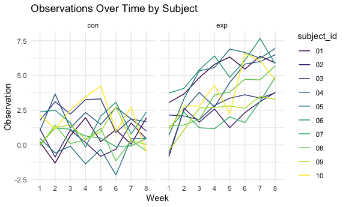

p8105_hw5_yl5214
================

``` r
library(tidyverse)
library(purrr)
library(ggplot2)
```

Set seed for reproducibility.

``` r
set.seed(12345)
```

## Question 1

For this problem, we are interested in data gathered and made public by
*The Washington Post* on homicides in 50 large U.S. cities. The code
chunk below imports and cleans the data.

``` r
homicide_df = 
  read_csv("data/homicide-data.csv", na = c("", "NA", "Unknown")) %>%
  mutate(
    city_state = str_c(city, state, sep = ", "),
    resolution = case_when(
      disposition == "Closed without arrest" ~ "unsolved",
      disposition == "Open/No arrest"        ~ "unsolved",
      disposition == "Closed by arrest"      ~ "solved"
    )
  ) %>% 
  filter(city_state != "Tulsa, AL") 
```

    ## Rows: 52179 Columns: 12
    ## ── Column specification ────────────────────────────────────────────────────────
    ## Delimiter: ","
    ## chr (8): uid, victim_last, victim_first, victim_race, victim_sex, city, stat...
    ## dbl (4): reported_date, victim_age, lat, lon
    ## 
    ## ℹ Use `spec()` to retrieve the full column specification for this data.
    ## ℹ Specify the column types or set `show_col_types = FALSE` to quiet this message.

The resulting dataframe has 52178 entries, on variables that include the
victim name, race, age, and sex; the date the homicide was reported; and
the location of the homicide. In cleaning, I created a `city_state`
variable that includes both city and state, and a `resolution` variable
to indicate whether the case was closed by arrest. I also excluded one
entry in Tulsa, AL, which is not a major US city and is most likely a
data entry error.

In the next code chunk, I group within cities and summarize to produce
the total number of homicides and the number that are solved.

``` r
city_homicide_df = 
  homicide_df %>% 
  select(city_state, disposition, resolution) %>% 
  group_by(city_state) %>% 
  summarize(
    hom_total = n(),
    hom_unsolved = sum(resolution == "unsolved"))
```

Focusing only on Baltimore, MD, I can use the `prop.test` and
`broom::tidy` functions to obtain an estimate and CI of the proportion
of unsolved homicides in that city. The table below shows those values.

``` r
bmore_test = 
  prop.test(
    x = filter(city_homicide_df, city_state == "Baltimore, MD") %>% pull(hom_unsolved),
    n = filter(city_homicide_df, city_state == "Baltimore, MD") %>% pull(hom_total)) 

broom::tidy(bmore_test) %>% 
  knitr::kable(digits = 3)
```

| estimate | statistic | p.value | parameter | conf.low | conf.high | method                                               | alternative |
|---------:|----------:|--------:|----------:|---------:|----------:|:-----------------------------------------------------|:------------|
|    0.646 |   239.011 |       0 |         1 |    0.628 |     0.663 | 1-sample proportions test with continuity correction | two.sided   |

Building on this code, I can use functions in the `purrr` package to
obtain estimates and CIs for the proportion of unsolved homicides in
each city in my dataset. The code below implements this analysis.

``` r
test_results = 
  city_homicide_df %>% 
  mutate(
    prop_tests = map2(hom_unsolved, hom_total, \(x, y) prop.test(x = x, n = y)),
    tidy_tests = map(prop_tests, broom::tidy)) %>% 
  select(-prop_tests) %>% 
  unnest(tidy_tests) %>% 
  select(city_state, estimate, conf.low, conf.high) %>% 
  mutate(city_state = fct_reorder(city_state, estimate))
```

Finally, I make a plot showing the estimate (and CI) of the proportion
of unsolved homicides in each city.

``` r
test_results %>% 
  mutate(city_state = fct_reorder(city_state, estimate)) %>% 
  ggplot(aes(x = city_state, y = estimate)) + 
  geom_point() + 
  geom_errorbar(aes(ymin = conf.low, ymax = conf.high)) + 
  theme(axis.text.x = element_text(angle = 90, hjust = 1))
```


This figure suggests a very wide range in the rate at which homicides
are solved – Chicago is noticeably high and, given the narrowness of the
CI, likely is the location of many homicides.

## Question 2

``` r
# Step 1: Get a list of file names in the directory
file_path = list.files(path = "data/question 2", pattern = "\\.csv$", full.names = TRUE)
#Iterate over file names and read in data for each subject using purrr::map and saving the result as a new variable in the dataframe
data= 
  file_path |> as.data.frame() |> mutate(data=map(file_path,read_csv)) |> as.tibble() |> unnest() |> 
mutate(
  file_path=str_replace(file_path,'\\.csv', ''),
  file_path=str_replace(file_path, 'data/question 2/','')
) |>   
  pivot_longer(
      week_1:week_8,
      names_to ='week',
      names_prefix= 'week_',
      values_to='observation'
    ) |> 
  separate(file_path, into = c('arm','subject_id'), sep='\\_') 
```

    ## Rows: 1 Columns: 8
    ## ── Column specification ────────────────────────────────────────────────────────
    ## Delimiter: ","
    ## dbl (8): week_1, week_2, week_3, week_4, week_5, week_6, week_7, week_8
    ## 
    ## ℹ Use `spec()` to retrieve the full column specification for this data.
    ## ℹ Specify the column types or set `show_col_types = FALSE` to quiet this message.
    ## Rows: 1 Columns: 8
    ## ── Column specification ────────────────────────────────────────────────────────
    ## Delimiter: ","
    ## dbl (8): week_1, week_2, week_3, week_4, week_5, week_6, week_7, week_8
    ## 
    ## ℹ Use `spec()` to retrieve the full column specification for this data.
    ## ℹ Specify the column types or set `show_col_types = FALSE` to quiet this message.
    ## Rows: 1 Columns: 8
    ## ── Column specification ────────────────────────────────────────────────────────
    ## Delimiter: ","
    ## dbl (8): week_1, week_2, week_3, week_4, week_5, week_6, week_7, week_8
    ## 
    ## ℹ Use `spec()` to retrieve the full column specification for this data.
    ## ℹ Specify the column types or set `show_col_types = FALSE` to quiet this message.
    ## Rows: 1 Columns: 8
    ## ── Column specification ────────────────────────────────────────────────────────
    ## Delimiter: ","
    ## dbl (8): week_1, week_2, week_3, week_4, week_5, week_6, week_7, week_8
    ## 
    ## ℹ Use `spec()` to retrieve the full column specification for this data.
    ## ℹ Specify the column types or set `show_col_types = FALSE` to quiet this message.
    ## Rows: 1 Columns: 8
    ## ── Column specification ────────────────────────────────────────────────────────
    ## Delimiter: ","
    ## dbl (8): week_1, week_2, week_3, week_4, week_5, week_6, week_7, week_8
    ## 
    ## ℹ Use `spec()` to retrieve the full column specification for this data.
    ## ℹ Specify the column types or set `show_col_types = FALSE` to quiet this message.
    ## Rows: 1 Columns: 8
    ## ── Column specification ────────────────────────────────────────────────────────
    ## Delimiter: ","
    ## dbl (8): week_1, week_2, week_3, week_4, week_5, week_6, week_7, week_8
    ## 
    ## ℹ Use `spec()` to retrieve the full column specification for this data.
    ## ℹ Specify the column types or set `show_col_types = FALSE` to quiet this message.
    ## Rows: 1 Columns: 8
    ## ── Column specification ────────────────────────────────────────────────────────
    ## Delimiter: ","
    ## dbl (8): week_1, week_2, week_3, week_4, week_5, week_6, week_7, week_8
    ## 
    ## ℹ Use `spec()` to retrieve the full column specification for this data.
    ## ℹ Specify the column types or set `show_col_types = FALSE` to quiet this message.
    ## Rows: 1 Columns: 8
    ## ── Column specification ────────────────────────────────────────────────────────
    ## Delimiter: ","
    ## dbl (8): week_1, week_2, week_3, week_4, week_5, week_6, week_7, week_8
    ## 
    ## ℹ Use `spec()` to retrieve the full column specification for this data.
    ## ℹ Specify the column types or set `show_col_types = FALSE` to quiet this message.
    ## Rows: 1 Columns: 8
    ## ── Column specification ────────────────────────────────────────────────────────
    ## Delimiter: ","
    ## dbl (8): week_1, week_2, week_3, week_4, week_5, week_6, week_7, week_8
    ## 
    ## ℹ Use `spec()` to retrieve the full column specification for this data.
    ## ℹ Specify the column types or set `show_col_types = FALSE` to quiet this message.
    ## Rows: 1 Columns: 8
    ## ── Column specification ────────────────────────────────────────────────────────
    ## Delimiter: ","
    ## dbl (8): week_1, week_2, week_3, week_4, week_5, week_6, week_7, week_8
    ## 
    ## ℹ Use `spec()` to retrieve the full column specification for this data.
    ## ℹ Specify the column types or set `show_col_types = FALSE` to quiet this message.
    ## Rows: 1 Columns: 8
    ## ── Column specification ────────────────────────────────────────────────────────
    ## Delimiter: ","
    ## dbl (8): week_1, week_2, week_3, week_4, week_5, week_6, week_7, week_8
    ## 
    ## ℹ Use `spec()` to retrieve the full column specification for this data.
    ## ℹ Specify the column types or set `show_col_types = FALSE` to quiet this message.
    ## Rows: 1 Columns: 8
    ## ── Column specification ────────────────────────────────────────────────────────
    ## Delimiter: ","
    ## dbl (8): week_1, week_2, week_3, week_4, week_5, week_6, week_7, week_8
    ## 
    ## ℹ Use `spec()` to retrieve the full column specification for this data.
    ## ℹ Specify the column types or set `show_col_types = FALSE` to quiet this message.
    ## Rows: 1 Columns: 8
    ## ── Column specification ────────────────────────────────────────────────────────
    ## Delimiter: ","
    ## dbl (8): week_1, week_2, week_3, week_4, week_5, week_6, week_7, week_8
    ## 
    ## ℹ Use `spec()` to retrieve the full column specification for this data.
    ## ℹ Specify the column types or set `show_col_types = FALSE` to quiet this message.
    ## Rows: 1 Columns: 8
    ## ── Column specification ────────────────────────────────────────────────────────
    ## Delimiter: ","
    ## dbl (8): week_1, week_2, week_3, week_4, week_5, week_6, week_7, week_8
    ## 
    ## ℹ Use `spec()` to retrieve the full column specification for this data.
    ## ℹ Specify the column types or set `show_col_types = FALSE` to quiet this message.
    ## Rows: 1 Columns: 8
    ## ── Column specification ────────────────────────────────────────────────────────
    ## Delimiter: ","
    ## dbl (8): week_1, week_2, week_3, week_4, week_5, week_6, week_7, week_8
    ## 
    ## ℹ Use `spec()` to retrieve the full column specification for this data.
    ## ℹ Specify the column types or set `show_col_types = FALSE` to quiet this message.
    ## Rows: 1 Columns: 8
    ## ── Column specification ────────────────────────────────────────────────────────
    ## Delimiter: ","
    ## dbl (8): week_1, week_2, week_3, week_4, week_5, week_6, week_7, week_8
    ## 
    ## ℹ Use `spec()` to retrieve the full column specification for this data.
    ## ℹ Specify the column types or set `show_col_types = FALSE` to quiet this message.
    ## Rows: 1 Columns: 8
    ## ── Column specification ────────────────────────────────────────────────────────
    ## Delimiter: ","
    ## dbl (8): week_1, week_2, week_3, week_4, week_5, week_6, week_7, week_8
    ## 
    ## ℹ Use `spec()` to retrieve the full column specification for this data.
    ## ℹ Specify the column types or set `show_col_types = FALSE` to quiet this message.
    ## Rows: 1 Columns: 8
    ## ── Column specification ────────────────────────────────────────────────────────
    ## Delimiter: ","
    ## dbl (8): week_1, week_2, week_3, week_4, week_5, week_6, week_7, week_8
    ## 
    ## ℹ Use `spec()` to retrieve the full column specification for this data.
    ## ℹ Specify the column types or set `show_col_types = FALSE` to quiet this message.
    ## Rows: 1 Columns: 8
    ## ── Column specification ────────────────────────────────────────────────────────
    ## Delimiter: ","
    ## dbl (8): week_1, week_2, week_3, week_4, week_5, week_6, week_7, week_8
    ## 
    ## ℹ Use `spec()` to retrieve the full column specification for this data.
    ## ℹ Specify the column types or set `show_col_types = FALSE` to quiet this message.
    ## Rows: 1 Columns: 8
    ## ── Column specification ────────────────────────────────────────────────────────
    ## Delimiter: ","
    ## dbl (8): week_1, week_2, week_3, week_4, week_5, week_6, week_7, week_8
    ## 
    ## ℹ Use `spec()` to retrieve the full column specification for this data.
    ## ℹ Specify the column types or set `show_col_types = FALSE` to quiet this message.

``` r
data
```

    ## # A tibble: 160 × 4
    ##    arm   subject_id week  observation
    ##    <chr> <chr>      <chr>       <dbl>
    ##  1 con   01         1            0.2 
    ##  2 con   01         2           -1.31
    ##  3 con   01         3            0.66
    ##  4 con   01         4            1.96
    ##  5 con   01         5            0.23
    ##  6 con   01         6            1.09
    ##  7 con   01         7            0.05
    ##  8 con   01         8            1.94
    ##  9 con   02         1            1.13
    ## 10 con   02         2           -0.88
    ## # ℹ 150 more rows

``` r
#Make a spaghetti plot
data |>
  mutate(subject_id=factor(subject_id),arm=factor(arm)) |>  
  ggplot(aes (x=week , y=observation,color=subject_id))+
  geom_line(aes(group=subject_id))+
  facet_grid(~arm)+
    labs(title = "Observations Over Time by Subject", x = "Week", y = "Observation")+
  theme_minimal()
```


The pattern of observation for exposure group is significantly higher
than the pattern of observation for the control group from week 1 to
week 8. For control group, the observation is oscillateed around 1.25
through week1 to week8. For exposure group, the observation has sharp
increase from week 1 to week 8. There are more negative observation in
control group than those in the exposure group.

## Question 3

``` r
sim_mean_p = function(mu,n=30,sd=5) {
  simulation=tibble(x=rnorm(n=30, mean = mu, sd = 5))
  p_value=t.test(pull(simulation, x), mu=0, alpha = 0.05) |> 
    broom::tidy() |> 
    select(estimate, p.value)
} 

##Repeat the above for μ={0,1,2,3,4,5,6}
repeat_result = 
  expand_grid(
    mu = c(0,1,2,3,4,5,6),
    iter = 1:5000
  ) |> 
  mutate(estimate_df = map(mu, sim_mean_p)) |> 
  unnest(estimate_df)
head(repeat_result)
```

    ## # A tibble: 6 × 4
    ##      mu  iter estimate p.value
    ##   <dbl> <int>    <dbl>   <dbl>
    ## 1     0     1   0.394   0.649 
    ## 2     0     2   1.56    0.195 
    ## 3     0     3   2.18    0.0363
    ## 4     0     4   0.126   0.895 
    ## 5     0     5  -0.278   0.806 
    ## 6     0     6   0.0257  0.978

``` r
## Make a plot showing the proportion of times the null was rejected (the power of the test) on the y axis and the true value of μ on the x axis.
plot1= 
  repeat_result|>
  group_by(mu) |> 
  mutate(reject= as.numeric(p.value<0.05)) |> 
  summarise(power = mean(reject)) |>
  ggplot(aes(x=mu, y=power))+
  geom_point()+
  geom_path()+
  labs(title = "Power vs Effect Size",
       x = "Effect Size",
       y = "Power") +
  theme_minimal()

plot1
```


\## Interpretation: The graph shows a positive association between true
mean and power.As the effect size goes up from 0 to 6, power goes up
from 0.00 to 1.00. This is because a larger effect size is associated
with increased statistical power, making it easier to detect a
statistically significant difference.

``` r
##Make a plot showing the average estimate of μ̂ on the y axis and the true value of μ on the x axis. Make a second plot (or overlay on the first) the average estimate of μ̂ only in samples for which the null was rejected on the y axis and the true value of μ on the x axis.
average_mean=
  repeat_result |> 
  group_by(mu) |> 
  summarise(average=mean(estimate)) |> 
mutate(case='average estimate of μ')

re_average_mean=
  repeat_result |> 
  filter(p.value<0.05) |> 
  group_by(mu) |> 
  summarise(average=mean(estimate)) |> 
mutate(case= 'null was rejected')

bind_rows(average_mean,re_average_mean)|> 
  ggplot(aes(x=mu, y=average, color=case))+
  geom_point()+
  geom_path()+
  labs(title = "Average Estimate of μ̂",
       x = "True mu",
       y = "Average Estimate of μ̂") +
  theme_minimal()
```


\## Is the sample average of μ̂ across tests for which the null is
rejected approximately equal to the true value of μ? Why or why not?
When the true value of mu is from 0 to 3, sample average of μ̂ is
different from the true value of mu because the power and effect size is
small. When the true value of mu is from 4-6, sample average of μ̂ is
approximately equal to the true value of mu because the effect size and
power is larger. When the effect size is smaller, there is a lower power
and fewer rejection from tests.
